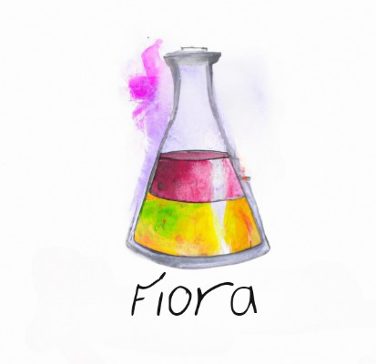

.. These are examples of badges you might want to add to your README:
   please update the URLs accordingly

    .. image:: https://api.cirrus-ci.com/github/<USER>/Fiora.svg?branch=main
        :alt: Built Status
        :target: https://cirrus-ci.com/github/<USER>/Fiora
    .. image:: https://readthedocs.org/projects/Fiora/badge/?version=latest
        :alt: ReadTheDocs
        :target: https://Fiora.readthedocs.io/en/stable/
    .. image:: https://img.shields.io/coveralls/github/<USER>/Fiora/main.svg
        :alt: Coveralls
        :target: https://coveralls.io/r/<USER>/Fiora
    .. image:: https://img.shields.io/pypi/v/Fiora.svg
        :alt: PyPI-Server
        :target: https://pypi.org/project/Fiora/
    .. image:: https://img.shields.io/conda/vn/conda-forge/Fiora.svg
        :alt: Conda-Forge
        :target: https://anaconda.org/conda-forge/Fiora
    .. image:: https://pepy.tech/badge/Fiora/month
        :alt: Monthly Downloads
        :target: https://pepy.tech/project/Fiora
    .. image:: https://img.shields.io/twitter/url/http/shields.io.svg?style=social&label=Twitter
        :alt: Twitter
        :target: https://twitter.com/Fiora

    .. image:: https://img.shields.io/badge/-PyScaffold-005CA0?logo=pyscaffold
        :alt: Project generated with PyScaffold
    :target: https://pyscaffold.org/

|

=====
Fiora
=====

    Data testing suite for medical imaging data

This framework gathers inspiration from the great expectations data testing package. Great expectations is only working for tabular data, therefore this package was made to be similar but work better with medical imaging data and to be more flexible in machine & deep learning pipelines on console interfaces and more closed systems.

.. _pyscaffold-notes:

Note
====

None at the moment.
